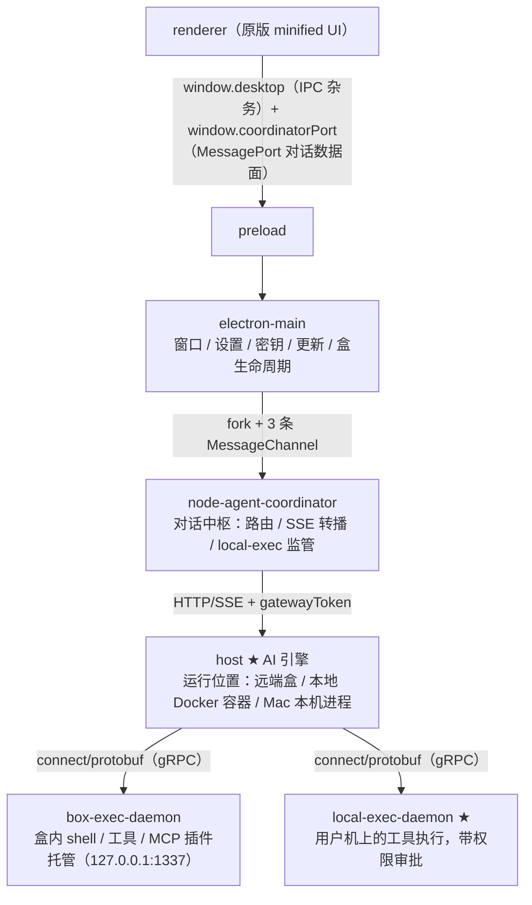

# Grok Bot 0.18 学习金字塔

> 目标：低认知负担地抓住这个项目的底层逻辑，并把注意力留给三件事——**架构理解、工程化思维、工程取舍与判断倒推**。
> 结构：金字塔法则（结论先行 → 逐层概括 → MECE 分组）。每层最多 5 条，每条都可向下追问。
> 证据标注：[实证] = 分析时在代码/文档中直接看到；[推断] = 合理推测（附依据）。
>
> 归档说明：本文是分析文档，随本仓库一起版本化；`docs/LEARNING-PYRAMID.html` 是它的排版版本，内容以本文为准。
> 文中的 `file:line` 是写作时的快照，代码演进后行号会移动，因此**定位证据时以引号内的符号名（函数、常量、类名）为准**；
> 行号与符号不一致时按符号在文件里检索。

---

## 顶层结论（金字塔尖 · 一句话）

> **Grok Bot 是一条"把信任编成进程、把对话编成协议流、把诚实编成可执行门禁"的工程主线。读懂它要先分清两件事：回合在哪里调度，模型服务在哪里——原版把 agent 引擎（host）放在远端盒里，桌面应用只是盒的客户端；本仓库另外支持同一个 host 进程跑在本地 Docker 容器里，以及让 Mac coordinator 执行一轮（`resolveLocalAdminBox` 可以返回 `mac-host`，`SAND_LOCAL_ADMIN_TURN=mac` 时路由的 provider 在 Mac 侧执行）。而这个重建项目是同一工程精神的镜像：重建者的"证据门禁驱动"与原作者的"安全边界驱动"互为表里。**

向下问"为什么这么说" → 五个支柱：

| 支柱 | 回答的问题 | 一句话 |
|---|---|---|
| **A 架构** | 它是什么 | 五进程三层沙箱：回合调度、模型服务、工具执行各有运行位置 |
| **B 机制** | 它怎么运转 | 一次对话 = 路由 × 双层循环 × 两条事件产生路径 |
| **C 实践** | 它怎么防错 | 三层纪律对抗"悄悄漂移"：身份校验 / 闭包审计 / 双轨验证 |
| **D 取舍** | 它为什么长这样 | 每个决策都有明码标价的代价 |
| **E 元认知** | 学了对我有什么用 | 技术会过时，判断系统可迁移 |

---

## 支柱 A · 架构：五进程三层沙箱

**A 结论：这个桌面应用是个"瘦客户端"——本地只有 UI 和调度，真正的 agent 引擎（host）通过一个 broker 返回的 gatewayUrl+token 被连接。host 的运行位置有三种：远端盒（原版默认）、本地 Docker 容器（本仓库自建镜像）、以及 Mac 本机进程。**

要点：

1. **host 不在桌面端，但运行位置有几种** [实证] —— main 通过 connect protobuf 调 broker `ensureSandBox` 拿到 `gatewayUrl+gatewayToken` 后才连上盒（`box-host-connector.ts` 的 `BrokeredHostConnector.connect`）；local-docker 模式等价替换为 `docker run` 暴露 `127.0.0.1:1340`（`local-docker-host-connector.ts` 的 `LOCAL_DOCKER_GATEWAY_URL`）；同一文件里的 `resolveLocalAdminBox` 还可以返回 `mac-host`，此时 host 作为 Mac 本机进程运行。**用户机器上唯一的本地代理是 local-exec-daemon**——这正是"本地工具权限审批"存在的前提。
2. **回合调度位置与模型服务位置要分开看** [实证] —— 即使 host 在盒里，一轮问答也可能在 Mac 侧调度：`SAND_LOCAL_ADMIN_TURN=mac` 时 `inference-router.ts` 的路由器接手 `sendPrompt`，用 Mac 上的 CLI 与凭据执行。因此判断"文件权限、凭据位置、命令在谁的机器上跑"时，要看的是**这一轮的调度平面**，以及 host 进程实际运行在哪里。
2. **两条通道是整套架构的脊柱** [实证+推断] —— 对话数据（sendPrompt/事件流）走 `fork + MessagePort 帧`，避开 Electron IPC 序列化瓶颈；桌面杂务（设置/密钥）走 `window.desktop` 的 IPC。职责分工：数据面走直连通道，控制面走 IPC edge。
3. **协议分层即信任分层** [实证] —— 进程内 JSON 帧有严格生命周期（协议违规直接 settle 退出）；HTTP 层有 loopback 绑定 + gatewayToken + 15s SSE 心跳；对外才用 connect 带认证头。信任随距离递减。
4. **"方法表"是原版的第一等架构物** [实证] —— `MAIN_METHOD_TABLE`（shared/rpc/main.ts）、`COORDINATOR_METHOD_TABLE`（coordinator.ts 的 `COORDINATOR_METHOD_TABLE`）、`SAND_GATEWAY_COMMANDS`（gateway-protocol.ts，注释写明"Mechanically recovered from the immutable 0.18 host bundle"）三张表分别写定三层协议。**读协议，先找方法表。**
5. **重建的插入点极小** [实证] —— Router 只在 coordinator 的 `dispatchRequest` 一处钩子（`inference-router.ts` 的 `dispatch` 返回 `handled`）接管 sendPrompt，其余原样透传。**一个分派函数即可整体替换推理后端**——最小侵入范式。

---

## 支柱 B · 机制：一次对话 = 路由 × 双层循环 × 事件流

**B 结论：模型"思考"在 host 的循环里，工具"行动"被抽象成跨进程 protobuf 消息流分发给两个 daemon。事件面有两条产生路径：host 的轮次把模型流转成 `InteractionUpdate` 事件流；Mac coordinator 的路由器直接合成 transcript 条目并发布 `appended`/`updated` 事件。渲染层因此不关心 provider 是谁。**

1. **路由 = 策略叠加** [实证] —— 决策数据只有一处：`settings.json` 的 `inferenceProvider` 字段（`sand-settings-store.ts` 的 `getInferenceProvider`）；决策点有两个：coordinator 拦截 `sendPrompt`（`inference-router.ts`）+ host 按同一 settings 选会话。接入差异：cursor 复用沙箱登录态；codex 直读 `~/.codex/auth.json`（强制 0600 普通文件、拒 symlink、401 自动 refresh_token 刷新）；claude-code 用 SDK spawn CLI 子进程；openrouter 用 `@ai-sdk/openai` 直连 + 密钥走 box-secrets。
2. **步数预算 + 特定故障处理** [实证] —— turn 层：`for (step < maxSteps && !aborted)`，上限由 `SAND_AGENT_MAX_STEPS`（5000）给出（`turn-agent-composition.ts` 的 `maxSteps`），正常结束条件 = 无工具调用且无排队消息；step 层：`streamModelAndCollectToolCalls` 边流式收输出边收集工具调用，工具**并发执行**，结果以 `role:"tool"` 回喂（`tool-stream-executor.ts`）。上限约束的是**循环次数**：它不保证任务完成，也不单独约束每一步的等待时间（模型响应、工具流与工具 promise 的等待在此期间没有步级超时）。熔断是**特定故障**的处理：收到 `EXEC_BACKEND_UNAVAILABLE` 分类时跳过工具并注入错误结果，避免死循环。超时、取消与"任务真的做完"是三件不同的事，各自需要自己的保证。
3. **两条事件产生路径** [实证] —— host 轮次把模型流转成 `InteractionUpdate`：textDelta / thinkingDelta / thinkingCompleted / toolCallStarted/Delta/Completed / partialToolCall / tokenDelta（`agent-core/interaction-updates.ts`），消息↔proto 双向转换在 `chat-inference-proto/converters.ts`。**Mac coordinator 的路由器不走这条转换**：它直接构造 `{kind:"send-message"}` 条目，经 `emitTranscript` 发 `postEvent("transcript", …)`（`inference-router.ts`）。排查显示与投递问题时，先确认事件是这两条路径中的哪一条产生的，否则会追错转换层。进程边界即协议边界，脱敏是边界投影的一部分（跨进程投影 redacted proto）。
4. **执行分治** [实证] —— agent 只面对 `RemoteExecManager` 抽象（`agent-exec/remote.ts`），不知道工具在哪跑：盒内工具 → box-exec-daemon（Connect gRPC）；用户机工具 → local-exec-daemon（带权限门+审批）；目标分表面：盒内 `Shell`/`Read` 与 用户机 `ExternalShell`/`ExternalRead`（`sand-activity.ts`）。**插件 MCP 服务器也归这一层**：stdio 服务器由盒内 daemon 启动并托管（`box-exec-daemon/mcp-host.ts` 的 `BoxMcpHost`），盒内轮次通过回环桥（`shared/node/mcp/routed-mcp-bridge.ts`）把工具交给 CLI 子进程，HTTP 服务器仍由后端执行。
5. **"看起来一致"的代价** [推断，依据：状态分治] —— cursor 走远端 gateway 原生状态（thinking 原生透传）；routed provider 只有文本 delta，router **合成** transcript 事件——thinking 是合成的 activity 行（250ms pulse 防渲染抖动）、reactions 本地存储。渲染层无法区分 provider，代价是流式细节降级为合成呈现。
6. **工具参数的搬运纪律** [实证] —— 命令型工具的权限回调必须把工具参数**原样交回**：Claude CLI 用权限结果里的 `updatedInput` 覆盖工具参数，交回空对象会把模型给出的参数全部抹掉（`provider-session.ts` 的 `claudeToolPermission` 与 `allowUnchanged`）。参数跨进程序列化时在边界处把普通 JSON 转成 protobuf `Value`（`box-mcp-exec.ts` 的 `toMcpArgs`），与后端执行端口保持一致。

---

## 支柱 C · 实践：三层纪律对抗"悄悄漂移"

**C 结论：重建品的最大风险是"与原版悄悄不一样"。作者的回应是三层可执行纪律——每个脚本都在防一个具体的坑。**

1. **身份校验（先写临时文件、校验通过才改名）** [实证] —— bootstrap 把下载内容写进 `.partial`（`mode 0o600`）→ 对临时文件算 SHA-256 → 不符则删除临时文件并抛错 → 相符才 `rename` 成正式缓存文件（`scripts/bootstrap-runtime.mjs`）。**保证是"未通过校验的下载不会成为正式缓存文件"**，临时文件在磁盘上确实出现过，因此它的信任状态与正式文件不同，不要在它上面做读取、解包或执行。DMG 与 app.asar 另外有固定哈希（`scripts/lib/config.mjs`）；补丁机制 fail-closed：patch 前 `stockSha256` 必须匹配、锚点必须**恰好出现一次**、patch 后 `patchedSha256` 必须匹配，任一不符直接 throw（`apply-third-party-patches.mjs`）。**供应链纪律：每条获取路径（LFS/缓存/下载/env）都校验。**
2. **闭包审计（把"不允许什么"写成代码）** [实证] —— `audit-renderer-closure.mjs`：clean 入口只允许 TS/TSX/JS/CSS，禁止任何 import 触碰不可变原版 artifact；`audit-runtime-composition.mjs`：`forbiddenEvidencePrefix = "src/app/"`，生产区域用显式 Set 枚举（新增不会静默替换、删除会报错）；`audit-ui-provenance.mjs`：`@evidence` 注解必须位于白名单根目录内。**防的是审计范围漂移。**
3. **双轨验证（交付门禁链，各管一件事）** [实证] —— 需要分清的四种保证：**输入身份**（DMG/app.asar 的哈希与 LFS 指针）、**产物组成**（`verify.mjs` 的 ASAR 必需文件清单含 4 个 agent-isolation worker、禁 source map、确定性 manifest 逐项比对、干净渲染器禁出现原版 chunk 名；其中"≥1000 条源码证据标记"统计的是 `sourceAppDir` 里上游 bundle 的 `// src/` 注释行数，证明的是**固定产物带有证据标注**，不能证明重建代码的行为正确）、**启动检查**（`native-e2e-check.mjs` 真实 spawn 打包 App，断言进程存活、renderer 出现、新用户目录下 host 与 coordinator 保持缺席；它不验证一轮对话是否走完）、**真实任务验证**（`docker/container-gates.sh` 的容器门禁与活体轮次，见 ROADMAP）。`package-fidelity-diagnostic.mjs` 做三方对照（官方参考 / 固定渲染包 / 重建包）且开局拒绝把诊断当交付；`verify-publication-tree.mjs` 用 `git archive HEAD` 树哈希证明导出无损。**"这些检查通过"要按它实际断言的范围来读，README 的声明不算数。**
4. **韧性细节（防的具体坑）** [实证] —— 错误进注册表不进字符串（`SAND_ERROR_DEFINITIONS` 带 `retryable` 标注，未注册错误在 emit 边界被重新分类，原始 code/payload 永不 ship）；host 锁带 PID 存活探测与升级接管（SIGTERM→SIGKILL，防锁残留卡死下次启动）；`WriteEpoch` 世代计数使过期写入失效（防乱序回写覆盖新值）；secret-store 全部 `temp + rename` 原子写。
5. **隐私剥离：策略可判定，是否执行由开关决定** [实证] —— 密钥模式正则剥除（`sk-`/`ghp_`/`xoxb`/`AIza`/`Bearer`）；invariant 消息打包时剥离但保留调用链信息（防泄露 + 可定位）；`PrivacyMode` 五档（full/scrubbed/fatal-metadata…）。策略层确实是可测的纯函数：`shouldRedact()`（`redaction/shouldRedact.ts`）对 `CREDENTIALS` 与 `UNSPECIFIED` 一律判定需要脱敏，`allowedPurpose()`（`redaction/types.ts`）按"模式 × 用途 × 分类"作答。**但"有策略函数"不等于"默认已经脱敏"**：是否真的代入策略由 `resolveEnforceRedaction()`（`redaction/privacy-context.ts`）决定，其全局开关 `isGlobalEnforcementEnabled()` 默认 `false`（`enforceRedactionGate?.() ?? false`），未启用时 `getRedactionAwareDisplayValue()` 原样返回未脱敏值。所以在默认参数下（`NO_STORAGE` + `CREDENTIALS`）显示路径给出的是原值，只有显式 `enforceRedaction: true` 才得到脱敏标记。启用条件与具体调用路径需要单独核对；这一条是策略与开关的读码结论，不能当作生产环境凭据外泄的证明，反向也一样。

---

## 支柱 D · 取舍：每个决策都有明码标价的代价

**D 结论：这是一次"可审计地重建"：在每一个决策点，可验证性都排在完整性前面。作者的取舍边界本身就是教材。**

### D1 重建者的取舍（决策 / 证据 / 代价 / 反事实）

| # | 决策 | 代价 | 证据 |
|---|---|---|---|
| 1 | **保留 shipped renderer，不重建前端**（明说"weekend build 不现实"） | UI 仍是黑盒，等价性只能靠哈希+闭包审计间接保证 | README.md 的取舍部分 |
| 2 | **hybrid 构建**：运行时编译自可读源码 + 渲染层保留固定产物 + 窄变换 | 构建强依赖外部 DMG 下载与公证校验 | README.md 的构建部分 |
| 3 | **独立 bundle id + ad-hoc 签名**，绝不继承上游签名 | 要处理 quarantine/Gatekeeper 平台坑；用户多一步"右键打开" | PROVENANCE.md |
| 4 | **绝不覆盖官方应用 + 注入 `SAND_DISABLE_UPDATES/SENTRY/TELEMETRY=1`** | 与原版行为差异（不更新、无遥测），靠 updater-guard 测试守护 | `build-asar.mjs` |
| 5 | **Git LFS 存原版安装包** + 每条获取路径校验 | 仓库依赖 LFS，克隆需 `git lfs pull` | .gitattributes + bootstrap |
| 6 | **第三方依赖打补丁**（`@connectrpc/connect@1.6.1` 空 body 问题），不改上游实现也不等上游 | patch 是定点修改，依赖升级即失效 | patches/ + postinstall |
| 7 | **Node 固定 ≥26.5 <27**（非 LTS 窄窗口） | 开发者须手动装指定版本 | .node-version + engines |
| 8 | **测试用原生 `node --test`**，零测试框架依赖 [推断] | 本项目尚未配置覆盖率、快照与分片；这些能力 Node 自带（`--experimental-test-coverage`、`--test-update-snapshots`、`--test-shard`），要用需要自己接上 | package.json 的 `test` 脚本 |

### D2 原作者被逆推出的取舍（证据级别）

1. **远程 box 执行模型** [观察：高 / 动机：推断] —— 观察到的是 `box-runtime.ts` 默认 `"remote"`，发布版只提供远端盒这一种执行面，代价是云成本与延迟。常见解释（不信任本地机器、执行环境一致、按用量计费）与代码一致，但代码里没有证据能确认哪一条是原作者的动机。**本地执行面的可选性属于本仓库的选择**：`resolveLocalAdminBox` 现在可以在 Docker 与 `mac-host` 之间选，因此不要把"发布版只有远端"当成本地执行在结构上不可行。
2. **进程分离 = 信任边界** [级别：中高] —— main（凭据/生命周期）≠ host（推理/工具）≠ 两个 daemon（执行）。崩溃隔离 + 权限最小化 + 可独立更新。
3. **connect/protobuf 做协议** [级别：中] —— 多语言客户端、强类型接口约定、流式支持；代价是依赖 bug 需自己打补丁。
4. **渲染层依赖很重**（React 19 + tiptap + katex + pdfjs + tree-sitter + JIMP 图片族）[观察：高 / 因果：不成立] —— 观察到的两件事：渲染层用到富文本、代码高亮与 PDF 内联；发布包含的是优化后的 bundle，没有授权源码，也没有 source map（`PROVENANCE.md`）。因此 `frontend/` 只能是**带证据的部分重建**。至于"依赖重"与"不发布源码"之间是否存在因果关系，代码与文档都没有给出依据，不作为结论。
5. **redaction/密钥桥设计** [级别：中高] —— 凭据分类最严、box-secrets 保留名单（`SAND_`/`__CURSOR` 前缀、上限 100 个/单值 32KB/总量 96KB）；LLM 会话含凭据，脱敏必须内建在类型层，事后过滤不足以承担。

### D3 元取舍（工程方法层面）

1. **可审计性优先于完整性** [实证] —— PROVENANCE.md 的 evidence-only rule："speculative behavior is a release-blocking defect"，宁可留空不猜。
2. **确定性优先于最新** [实证] —— DMG/app.asar/node/electron/connect 全部固定；升级是一次显式决策，默认不发生。
3. **文档化优先于注释化** [实证] —— README/PROVENANCE/NOTICE/PUBLISHING/CONTRIBUTING 把边界、代价、发布流程写成约定（CONTRIBUTING 要求 commit 声明影响的层、禁止弱化校验）。
4. **研究过程本身被"产品化"经营** [实证] —— CI 跑 typecheck + publication:check，连"如何发布这个研究仓库"都被工程化。

---

## 支柱 E · 元认知：可迁移的判断系统

**E 结论：这个仓库最值得学的有两套判断系统——原作者把安全承诺编译成结构，重建者把诚实编译成脚本。技术会过时，这两套系统可迁移到任何项目。**

### E1 四个可迁移范式

1. **Pinned 身份思维** —— 外部输入 = 不可变 + 校验身份。本项目对 DMG/app.asar 的**每条获取路径**都做 SHA-256，身份不符即删除该临时文件并抛错，不会成为正式缓存文件。别处：供应链、可复现构建、"下载即校验"。
2. **边界即约定** —— 进程/协议边界按 API 设计并配验证。adapter 目录是"结构性约定"（新增不能静默替换、删除会报错）。别处：微服务/插件系统先写边界约定再写实现。
3. **保真度预算（混合架构分层）** —— 先问"什么可重建且可验证、什么必须保留"。本项目：运行时可重建（有证据锚点），renderer 保留（无源码），分界处用"窄确定性 transform + 哈希记录"缝合。别处：任何 legacy 现代化/迁移，混合可以是正当的架构选择。
4. **门禁即验收，但要按断言的实际范围读** —— 把"成功"定义成可执行断言集，并拒绝为通过而削弱（clean-source 不得携带禁入证据）。要注意每条断言证明的是什么：产物组成可以证明（ASAR 清单、marker 数量、无 source map），启动可以证明（真实 spawn），而"一轮对话能跑完"要另找门禁（容器门禁与活体轮次）。别处：把验收标准写成脚本，测试失败 = 构建失败。

### E2 元认知阅读路径（每步训练一种判断）

| 步骤 | 读什么 | 训练什么 |
|---|---|---|
| 1 | README.md | **读取舍**：识别作者明说的放弃与理由 |
| 2 | PROVENANCE + CONTRIBUTING | **读约束系统**：每条规则约束什么行为、违反代价 |
| 3 | scripts/bootstrap-runtime.mjs | **Pinned 输入思维**：一个二进制如何变成可验证构建输入 |
| 4 | 一条对话链路（preload → main → coordinator → router → host → provider） | **边界即约定**：每层校验了什么、信任在哪断 |
| 5 | router 的 dispatch + verify.mjs | **最小可审计变更 + 门禁验证**的完整样本 |
| 6 | tests/ + smoke.mjs | **测试意图**：测真实模块、有预算、fail-closed |

### E3 判断练习问题（带着问题读代码）

1. 为什么要在 host 之外再分出 local-exec-daemon / box-exec-daemon？这条边界画在哪条线上？
2. redaction 为什么是"分类 × 用途 × 模式"的纯函数，而不写成分散的 if？简化成查表会丢什么？
3. 重建者为什么宁可保留 minified renderer？换你，你的"重建 vs 保留"边界和保真度预算是什么？
4. patch 为什么要求锚点"恰好出现一次"、缺失即失败？模糊匹配省下的时间买走了什么？
5. verify.mjs 数的那 ≥1000 个 source marker 统计的是上游 bundle 里的证据注释行，它证明的是什么、不证明什么？你自己项目里"检查通过"与"行为正确"之间的距离有多远？
6. 换 bundle id、ad-hoc 签名、默认关 telemetry——"无缝集成"与"身份诚实"冲突时你选哪个？
7. 原版隐含假设"必须连远端 box"；local Docker sandbox 动了哪些未说出的假设？你代码里有什么同类隐含假设？
8. bootstrap 对每条获取路径都校验——你自己的依赖/下载流程里，哪些路径被信任了却没校验？
9. 权限回调交回空参数会让工具"看起来调用成功"：你的系统里还有哪些地方把"没有收到"当成"没有需要"？

---

## 附录 · 证据索引（按支柱归类）

引号内是稳定的符号名，行号随代码演进会移动。

- **A 架构**：`frontend/src/production/bootstrap.tsx`（双通道）· `source/electron-preload/preload.ts`（窄桥）· `source/node-agent-coordinator/main.ts`（fork 引导）· `shared/rpc/coordinator-port.ts`（JSON 帧协议）· `source/host/main.ts`（host 入口）· `source/host/gateway-server.ts`（HTTP/SSE）· `box-host-connector.ts` 的 `BrokeredHostConnector.connect`（ensureSandBox）· `local-docker-host-connector.ts` 的 `LOCAL_DOCKER_GATEWAY_URL`（docker 模式）· `shared/rpc/coordinator.ts` 的 `COORDINATOR_METHOD_TABLE`（方法表）· `gateway-protocol.ts` 的 `SAND_GATEWAY_COMMANDS`（命令表）
- **B 机制**：`sand-settings-store.ts` 的 `getInferenceProvider` · `inference-router.ts` 的 `dispatch` 与 sendPrompt 拦截 · `provider-session.ts` 的 `claudeChildEnv` / `codexExecutor` / `claudeExecutor` / `openRouterExecutor` / `CLAUDE_LOCAL_TOOLS` / `claudeToolPermission` · `turn-agent-composition.ts` 的 `maxSteps` 与 `SAND_AGENT_MAX_STEPS` · `tool-stream-executor.ts` 的双层循环与熔断 · `interaction-updates.ts` 的 `InteractionUpdate` · `chat-inference-proto/converters.ts`（消息↔proto）· `agent-exec/remote.ts` 的 `RemoteExecManager` · `box-exec-daemon/server.ts` 的 `BOX_EXEC_DAEMON_PORT`（gRPC 1337）· `box-exec-daemon/mcp-host.ts` 的 `BoxMcpHost`（插件托管）· `shared/node/mcp/routed-mcp-bridge.ts`（回环桥）· `box-mcp-exec.ts` 的 `toMcpArgs`（参数归一化）· `sand-activity.ts`（目标分表）
- **C 实践**：`shared/errors/registry.ts`（错误注册表）· `host-lock.ts`（锁接管）· `write-epoch.ts`（世代计数）· `host-secret-store.ts`（原子写）· `scripts/bootstrap-runtime.mjs`（临时文件 + 校验 + 改名）· `audit-renderer-closure.mjs` / `audit-runtime-composition.mjs` / `audit-ui-provenance.mjs`（闭包审计）· `verify.mjs` / `native-e2e-check.mjs` / `smoke.mjs` / `package-fidelity-diagnostic.mjs` / `verify-publication-tree.mjs`（交付检查，各管一件事）· `apply-third-party-patches.mjs`（双哈希门禁）· `sand-auto-review-redact.ts`（密钥剥除）· `redaction/privacy-mode.ts` + `redaction/classification.ts` + `redaction/shouldRedact.ts` + `redaction/privacy-context.ts`（五档 / 分类 / 判定 / 开关）
- **D 取舍**：`README.md` · `PROVENANCE.md` · `scripts/lib/build-asar.mjs` · `scripts/lib/config.mjs` · `patches/@connectrpc__connect@1.6.1.patch` · `box-runtime.ts` · `shared/box-secrets.ts`（保留名单/上限）
- **E 元认知**：`README.md` · `PROVENANCE.md` · `CONTRIBUTING.md` · `docs/ARCHITECTURE.md` · `docs/PUBLISHING.md` · `redaction/shouldRedact.ts`（脱敏判定）· `redaction/privacy-context.ts`（执行开关）

---

*由 5 个并行分析 agent 的独立报告按金字塔法则合成：架构链路 / 核心机制 / 工程实践 / 取舍清单 / 元认知。每条要点保留 [实证]/[推断] 标注；完整证据定位见附录。*
