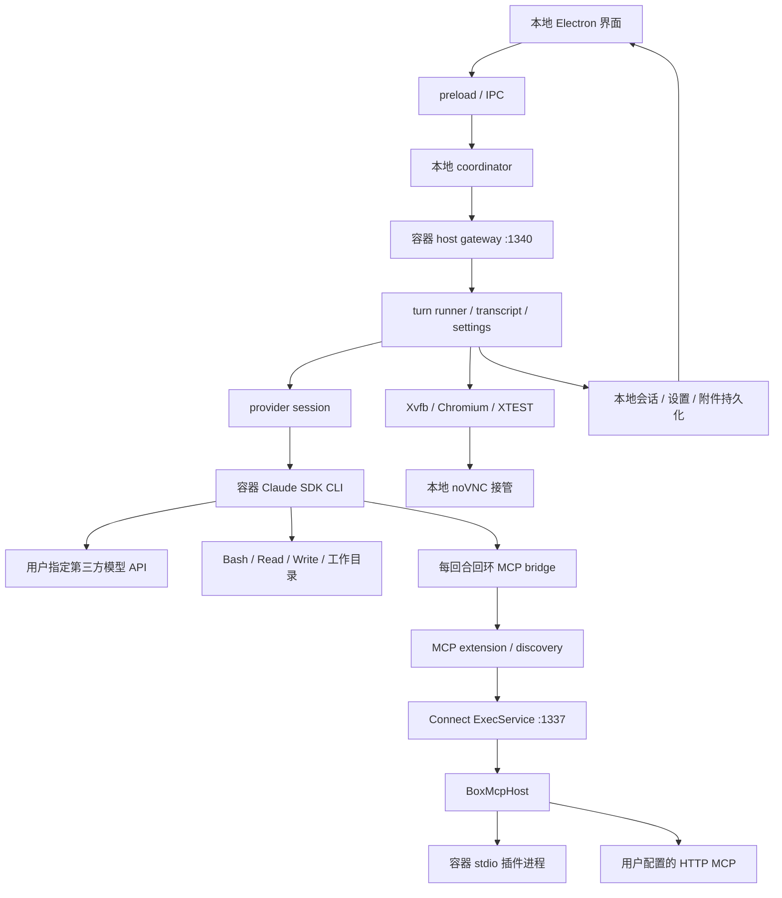

# 本地容器执行架构与改进顺序

用户在本地 Grok Bot 提交任务，容器里的 agent 调用指定的第三方模型 API 和本地工具，结果回到本地会话与工作目录；登录、付款和需要人工判断的操作由用户接管。

容器执行、provider、MCP、桌面工具与 macOS 安装包已进入 main。默认运行环境是项目专用的 Colima `grokbot` profile；OrbStack 作为可选 Docker socket 来源。发布包保留哈希固定的原版 0.18 renderer，host 与其余运行模块使用本仓库源码。

## 运行结构

`start-local.sh` 仅选择 Docker 和盒内回合。Docker 不可用直接报错；盒内回合需要本地自建镜像。`GROKBOT_BOX=host` 与 `GROKBOT_TURN=mac` 在启动副作用发生前报错。

## 模块、输入与下游

路径均相对于仓库根。这里记录生产入口和边界；生成 protobuf 的每个文件不重复列举。

| 模块 | 输入与职责 | 下游与状态 |
| --- | --- | --- |
| `source/electron-main` | 窗口、账号本地化、设置、容器启动与健康探测 | preload、coordinator、Docker、gateway 描述 |
| `source/electron-preload` | 受控 IPC 和界面命令 | coordinator / host command dispatch |
| `source/node-agent-coordinator` | 本地命令路由、host 连接、事件传递 | `gateway/host-supervisor.ts`、容器 host gateway |
| `source/host/main.ts`、`host-runner-composition.ts` | 容器服务装配、扩展注入、daemon 生命周期 | gateway、runner、extensions |
| `source/host/runner` | 会话上下文、回合预算、工具集、投递、取消与结算 | `turn-run-shell.ts`、`turn-toolset.ts`、`turn-settle.ts` |
| `source/host/extensions/inference` | 模型选择、SDK 调用、用量记录 | Claude SDK、AI SDK/OpenRouter、Codex direct transport |
| `source/shared/node/mcp` | 配置、工具发现、权限设置与路由 | box MCP exec、用户 HTTP MCP；远程账号模式另有 backend 路径 |
| `source/box-exec-daemon` | Connect RPC、shell/read/write、MCP 服务器持有者 | 工作目录、stdio 子进程、HTTP MCP SDK transport |
| `source/host/extensions/transcript` | transcript 保存、消息整形与事件投递 | `renderer-entry-shape.ts` 同时保留 `content` 与界面需要的 `text` |
| `source/host/extensions/settings`、`secrets`、`attachments` | 配置、凭据与附件存储 | 本地数据根；各自的读写与错误处理边界 |
| `source/host/extensions/memory`、`automations`、`notifications` | 记忆、自动任务、通知 | 本地 runner 与存储；目录存在不代表每项已通过第三方模型端到端验证 |
| `source/host/box` | 窗口与显示资源、owner token | 镜像的 start-window / stop-window / router |
| `source/packages` | Context、agent、transcript、存储、工具执行与 protobuf | host/coordinator/daemon 共享类型和行为 |
| `source/shared`、`source/internal` | 路径、配置、调度、错误、网络策略 | 多进程入口复用 |
| `docker/bin` 与基础镜像 | 桌面启动、浏览器导航、XTEST | Xvfb、xfwm4、Chromium、noVNC、session-sync |

## 依赖关系与部署边界

| 依赖 | 使用位置 | 是否需要 Cursor/xAI 运行期返回 |
| --- | --- | --- |
| Electron 与本地打包的 renderer | 桌面界面与 IPC | 使用经过 SHA-256 核对的原版 0.18 Electron 外壳与 renderer；不依赖 Cursor/xAI 运行期返回 |
| Docker / Colima、arm64 自建镜像 | 执行与桌面 | 本地运行；镜像构建需要基础镜像和软件包来源 |
| `@anthropic-ai/claude-agent-sdk` | 容器内 CLI agent | 通过 `ANTHROPIC_BASE_URL` 使用指定的兼容 API |
| `ai`、`@ai-sdk/openai` | OpenRouter provider | 使用所选第三方服务；当前本地没有 OpenRouter key |
| `@modelcontextprotocol/sdk` | HTTP/stdin-out MCP 两端 | 本地 stdio 或用户配置的 HTTP endpoint |
| `@connectrpc/connect*`、`@bufbuild/protobuf` | host/daemon RPC | 本地 endpoint；不能仅用全局 fetch 拦截推断所有 Connect 出口已受保护 |
| Statsig | 开关默认值与本地配置 | local-admin 不拉取官方 bootstrap，不发送 exposure，不启动刷新轮询 |
| 浏览器目标网站 / 用户配置插件 | 执行用户任务 | 由任务决定；本地部署仍允许用户授权的第三方网络服务 |
| 官方 0.18 应用构件 | Electron 外壳、renderer、原生依赖与历史证据 | 仍是经过固定哈希核对的构建输入；当前发布目标允许复用 |

默认发布包保留原版 renderer，并用精确补丁加入本地 Router 设置；`frontend/src` 是可读的开发与研究材料，不承担发布包的像素一致性要求。18 张原版静态图片已按原字节与 SHA-256 纳入 `frontend/assets` 供前端开发使用。`/Applications/Grok Bot 0.18 Reconstructed.app` 已安装从当前 main 构建并校验的应用。

第三方 API 地址、主模型及子模型映射由启动环境配置，启动脚本保留显式值。API token 由 provider 读取本地凭据文件并传入 CLI 子进程，测试和报告不输出凭据。

工作目录与数据目录职责分开：`SAND_AGENT_WORKSPACE` / `SAND_WORKSPACE_ROOT` 指向任务文件；`SAND_DATA_ROOT` 保存设置和会话。生产工作目录使用宿主机 bind mount，容器写入会同步影响该目录。测试使用独立数据 volume，代码挂载只读，生产容器保持运行。

## 生命周期和幂等规则

读取失败与持久状态截断的最新复核、PR #63–65 处理顺序见 [ROADMAP.md](ROADMAP.md)。截至 `f87850a`，build-stamp、Codex 配置和审计 outbox 的错误处理仍有待修复项；已有容器与 UI 验收不覆盖这些异常条件。

1. 回合拥有自己的 Context 和 MCP bridge。取消信号传到 Claude abortController、AI SDK abortSignal、Codex fetch、MCP HTTP 请求、盒内 Connect RPC 与 stdio MCP 客户端；bridge 随流关闭。已经发生的外部副作用不会因取消而撤销。
2. daemon 拥有 MCP client 与 stdio 子进程。回合结束关闭代理 bridge，插件生命周期由 daemon 配置与关闭操作决定。
3. 配置的键顺序不改变含义。等价配置保持已经连接的 client；配置移除或替换先释放旧 client。
4. 连接失败、远端关闭、工具列举失败向调用者报告。恢复由显式重新加载配置触发；工具调用不自动重放。
5. 工具列举消费全部分页；重复 cursor 明确报错。列举失败与工具不存在分别处理。
6. dispose 先阻止新操作，取消并关闭已有连接，再等待排队任务结束。并发关闭共享同一个完成 Promise；stdio 等待实际子进程 close 事件，超时明确报错，包含忽略 SIGTERM 后的强制终止路径。
7. bridge 使用官方 MCP SDK 处理 JSON-RPC。工具名和描述不用于猜测幂等性；非法工具定义不能被静默忽略。
8. 本地网络拦截在 Electron、host、coordinator 入口安装，多次安装保留同一 fetch 包装器。它是应用层保护，不能代替容器出口防火墙。
9. 本地配置文件保留 HTTP headers，读取时区分文件缺失和内容损坏。HTTP MCP 使用 Streamable HTTP；显式配置的旧 SSE endpoint 会给出不支持提示。

## 重要与紧急矩阵

| 顺序 | 重要程度 / 紧急程度 | 工作与完成标准 | 本次状态 |
| --- | --- | --- | --- |
| 1 | 高 / 高 | 默认保持容器执行，缺 Docker 或盒内镜像立即报错 | 已实现并验证选择逻辑 |
| 2 | 高 / 高 | 第三方 API 取消传播；容器 MCP HTTP 直连，释放资源 | 已实现；真实 Claude 回合、HTTP/stdin-out MCP 与 Codex 取消已执行验证 |
| 3 | 高 / 高 | MCP 配置幂等、断连状态、分页与关闭竞态 | 已实现；用真实进程和 SDK 验证，测试范围见下方 |
| 4 | 高 / 高 | 本地启动不等待官方 bootstrap，拦截入口覆盖 host/coordinator | 已实现并验证本地默认值、显式开关与幂等安装 |
| 5 | 高 / 中 | provider 使用 Grok turn 工具与权限 | Claude 已通过 macOS UI 的真实文件、MCP、图片附件与 Computer 子代理回合。Codex 在隔离容器用真实账号通过文本、工具续接、取消与转录验收。Command Code 的无效密钥在隔离容器调用真实接口，HTTP 401 使流及结果及时失败。OpenRouter、Command Code 的本地 key 为空，按当前验收范围未调用真实账号。 |
| 6 | 高 / 中 | MCP 取消到达实际执行进程 | 真实延时 stdio 插件和 daemon RPC 取消通过；调用期间取消后未写入完成标记。Mac 回合路径已移除 |
| 7 | 高 / 中 | 封锁 Cursor/xAI 返回时验证 UI→回合→工具→transcript→UI | 当前 main 的 macOS 包已安装并完成 GLM 文本、文件、MCP 与 Computer 回合。Mac 与容器拦截记录均为零 Cursor/xAI 外发；本次实际调用路径成立。 |
| 8 | 中 / 中 | router/session-sync 故障被健康检查发现并恢复 | 真实进程退出、健康判定与明确重建已通过隔离 Docker 验收 |
| 9 | 中 / 低 | 多显示随机访问凭证、资源配额、人工登录接管 | 随机凭证、旧凭证撤销、四窗口资源限制与真实 WebSocket 访问已验证；真人登录与交回需要测试账号和用户参与。 |
| 10 | 高 / 中 | 保留原版外观并核对发布包身份 | 默认包保留原版 renderer 的完整文件清单，精确补丁按顺序验证输入与输出 SHA-256；Electron 外壳、ASAR、原生依赖与重签名包体已在隔离环境核对。可读前端独立发布不再是交付要求 |

普通插件退出不触发自动重放。执行带外部副作用的工具后，网络断开并不能证明操作没有发生；恢复连接与重放调用分别处理。

## 需要用户提供条件才能继续验收的能力

1. **其他模型账户与附件。** OpenRouter 和 Command Code 的本地 key 为空，本轮遵循“仅验收已配置项”，所以没有真实账户调用结果。Command Code 已用固定无效密钥从隔离容器调用真实接口，HTTP 401 的错误传播与提示已验证；该结果不覆盖有效账号的文本、图片、工具调用、取消和转录回合。提供者可在应用 Settings → Router 保存各自密钥，再执行这些回合。Claude 已在 macOS UI 完成文本、文件、MCP、图片附件与 Computer。Codex 使用现有 `~/.codex/auth.json` 只读挂载到隔离容器，真实文本、工具续接、取消和转录通过；该账号需要显式选用其支持的模型 `gpt-6-astra`，仅凭当前默认模型 `gpt-5.4` 会收到 API 400。用户决定本轮不在生产容器使用 Codex 凭据，生产容器也不绑定 `~/.codex`；因此 Codex 图片附件与桌面应用 Settings 切换后的真实回合没有验收结论。
2. **passkey 与人工接管。** `sand-webauthn-signer` 已随固定哈希的原生依赖进入安装包，尚未在用户的 passkey 服务完成真实注册或登录。noVNC 的正确 token 与错误 token 已经通过真实 WebSocket 握手核对，Computer 也已操作桌面。用户决定本轮只验收自动化路径；真人输入凭据、交还控制权和会话恢复需要以后提供测试站点并亲自完成。
3. **公开分发与原版专用服务。** 当前本地安装已经完成；公开再分发仍需按 `PROVENANCE.md` 对原版 Electron、renderer、18 张图片和原生文件执行权利审查。发布包明确不包含 `csnaps` carrier，代码库遥测接口提供无操作实现。若交付目标包括复现该原版服务，需要单独确定其数据范围和用途。

## 基础镜像身份

固定基础镜像归档、原版安装包来源清单和校验下载器统一维护于 `grok-bot-box-image`。主仓库部署说明提供从该仓库获取固定镜像的步骤；不要求复制开发机器的缓存。镜像 Release 的文件 SHA 与镜像 manifest digest 分别验证。

基础镜像身份记录在 `docker/base-image.json`，由构建脚本按 digest 选择，并进入 `readDepsPin`。
`org.opencontainers.image.base.name` 镜像 label 保存构建使用的父镜像引用。
清单中的 `sourceRepository` 与 `sourceRevision` 对应基础镜像的 OCI label，构建时同时核对。Chromium 主 profile 的数据卷链接由基础镜像提供。

多屏同步使用 host 每三秒发布的全局 activity 文件。任意 agent 运行、状态超过十五秒、状态无法读取或人工接管文件存在时，延后后台写入；全部 agent 空闲后再同步。页面内在写入时检查 origin 和已有键，空页初始化与刷新在同一次页面执行中完成。每个浏览器实例和 origin 最多尝试两次自动刷新，同步轮次串行执行。该状态检查在发送命令前进行，不构成与任意外部浏览器操作的互斥锁；cookie 的读取和写入也受 CDP 两次调用之间的时间窗口限制。

## 代码保证的准确范围

- host 的远程执行请求使用 `RemoteExecManager`；第三方 provider 路线还会在 host 所在计算机启动 Claude CLI，由 CLI 执行本地工具。工具执行位置需要沿具体路线追踪。
- 盒内权限仍有约束：`claudeToolPermission` 处理人工接管与 `never` 设置；容器 bind mount 使盒内写入可影响用户文件。凭据可保存在 Mac 数据根，再以只读文件提供给容器。
- `allowedPurpose` 先允许 SAFE，再允许 `UNSAFE_ALWAYS_ALLOWED`，随后拒绝其他用途下的 CREDENTIALS / UNSPECIFIED。最终值是否经过策略还取决于 enforcement 开关，其默认值为 false。
- 纯函数与查表都可以配合类型约束、运行时校验和穷尽测试；包装器的字段占位、错误信息和日志可以独立保留。当前实现的选择不能推出查表必然丢失这些保证。
- 第三方补丁共同校验输入、输出 SHA；connectrpc 文本补丁另检查唯一锚点，tree-sitter 使用 transform 后核对输出 SHA。renderer 补丁采用自己的精确锚点规则与哈希记录。
- source marker 数量只证明指定产物中存在足量标记，无法单独证明代码未被替换或行为正确。输入身份需要 SHA 证据，真实任务需要沿生产路线执行验证。
- 重建包使用独立 bundle ID 和 ad-hoc 签名。更新行为由 updater guard、构建与运行环境共同控制，单个 bundle ID 无法证明完整的更新隔离。
- MCP 参数边界复用 `toJsonArgs` 归一化 JSON 与 protobuf Value，防止对预编码值再次套用 JSON 编码。

## Archive 的复用范围

参考目录：`/Users/xinheyun/Desktop/grok-compare/Archive`，重点为 `docs/grok_bot/确定-计算环境-架构.md`、`规格-MVP-v2.md` 和镜像内的桌面、窗口、浏览器脚本。

| 资产 | 应用方式 |
| --- | --- |
| start-desktop 的真实 PID 登记、EWMH 就绪检查 | 用于进程归属和健康验证；端口存在不能证明窗口管理器已就绪 |
| start-window / stop-window 的 owner token | 同一请求重入保持资源归属，关闭先撤销访问再终止进程 |
| noVNC 随机 token 和人机接管期限 | 用于多屏访问与接管生命周期；交回文件只证明交回动作，不能证明真人已访问 |
| session-sync 的缺失补充规则 | 保留当前会话，按明确条件同步，避免覆盖用户新状态 |
| 基础镜像与桌面组件 | 复用现有构建；当前产品继续采用 Connect 1337 / router 1339 / gateway 1340 |

Archive 的 18765 服务协议与当前产品不同。复用脚本、行为和验证标准足以支持本次目标，整体引入第二套服务会增加生命周期和数据同步负担。

## 执行证据与边界

- 显式 `SAND_HOST_GATEWAY_URL` 使用 `EnvDescriptorHostConnector`，保留指定地址和鉴权。local-exec credential issuer 为可选能力；默认 Docker 选择与不可用时报错的行为继续保留。
- 本地模式不查询官方 Slack/GitHub dashboard 连接状态，连接入口明确报告不支持；用户提供的自定义 dashboard 实现保留自己的连接能力。
- `scripts/ui-sandbox-smoke.mjs` 仅在 Linux 容器中运行，通过真实 Electron CDP 输入任务并读取 DOM。隔离网络中创建 Bot、发送任务，收到 Linux、文件 SHA256 和 MCP echo 回复。容器文件独立计算的 SHA256 为 `b9fb3a42d2e8df8f50f0221b7b13e39545416da389fd70f88cdc49a5e7e40876`，与 UI 回复一致；工具记录含对应 `mcp__grok_bot_plugins__echo__echo` 请求及成功结果。该场景使用 Claude SDK 和 GLM 5.2。
- UI 验收启动前需要通过产品设置或带 `version: 1` 的有效设置文件选择 `inferenceProvider: "claude-code"`。测试数据根、网关和浏览器 profile 均独立于生产。验收脚本输出随机文件名，需另外在 provider 容器核对文件内容和工具执行记录。

- macOS 完整构建执行 `npm run package`，包括前端与源码类型检查及全部自动化测试。`npm run verify` 核对 14 个可执行源码运行模块、ASAR、原生依赖、包体身份与签名。
- `Task` 默认在当前回合等待子代理结果，显式 `run_in_background: true` 才注册后续回合通知。父任务取消会终止前台子任务；两种模式共享状态、用量、审计和窗口释放流程。6 项真实子进程测试覆盖两种模式、取消与错误清理；`tests/provider-live-foreground-task.mjs` 在隔离容器经真实 Claude SDK / GLM API 和 host MCP bridge 验证子任务结果返回父任务，执行各一次、后台通知为零。
- 从当前 main 重新构建 `grok-bot-exec-box:arm64` 后，exec 门禁 G0–G5 与 desktop 门禁 D1–D6 全部通过，涵盖真实 Connect RPC 工具往返、缓存写入、1280×800 桌面、noVNC 访问控制、XTEST 截图与桌面进程持有者。
- `/Applications` 中的新包启动后，local admin 直接显示会话输入，不显示登录按钮。真实 GLM 回合完成容器内文件写入与读取、SHA-256、stdio MCP echo；独立读取的文件与界面回复一致。
- 真实 UI 请求经 `Task` 派发 `computerUse` 子代理，子代理用 `Computer` 完成鼠标移动和截图；独立检查持久化文件为 1280×800 PNG。截图 MIME、扩展名与文件内容一致。
- 真实 UI 上传仓库自带的 Router 设置页 PNG，发送后的用户转录含 `[Image]`；配置的 GLM 服务完成图像分析并识别 Router 页面。附件暂存使用 `node:crypto` 的 `randomUUID` 独立导出，避免未绑定方法在 Electron 主进程产生 `ERR_INVALID_THIS`。
- `scripts/command-code-invalid-key-smoke.mjs` 在只读隔离容器中调用 Command Code 的真实 `/chat/completions` 接口。固定无效密钥收到 HTTP 401；流、响应、用量和元数据五项均在超时前返回清晰的鉴权错误。该检查不使用生产凭据，也不验证有效账号的功能。
- 镜像仓库的真实双 Chromium 探针通过 22 项断言，涵盖忙态恢复、无效状态、人工接管、origin 变更和常驻刷新上限。`scripts/box-profile-persistence-e2e.mjs` 在独立数据卷写入真实 cookie/localStorage，随后强制结束并替换容器，验证数据保留及旧 Chromium 锁的恢复。
- Mac 拦截记录扫描 4171 行，包含 2114 次受阻的 Cursor/xAI 请求，零外发记录；容器记录扫描 961 行，零 Cursor/xAI 外发记录。这个证据覆盖已执行的回合与记录范围。早期网络隔离测试还在 Docker `--internal` 网络中只允许 GLM endpoint，并拒绝 Cursor/xAI 目标。
- 旧 `finonelib` profile 中与 Grok Bot 相关的容器、卷和镜像已清理，profile 本身因属于其他项目而保留并停止。运行中的项目专用 `grokbot` profile 只保留生产容器、生产数据卷、当前执行镜像和构建所需的基础镜像。

“零官方依赖”应以实际场景、实际拒绝网络条件和可观察结果表述。拦截日志没有记录出网、源码中存在保护判断，以及 provider smoke 成功，分别提供不同范围的证据；它们不能单独证明所有产品功能已经完整替代官方服务。
