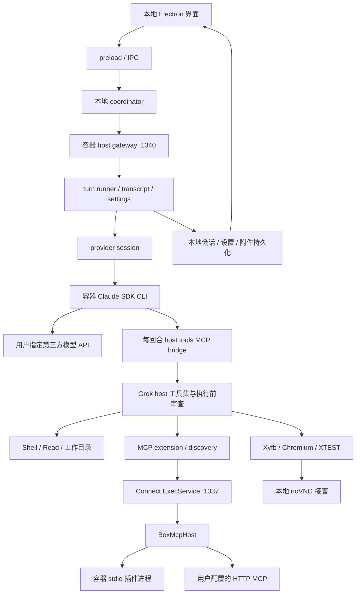

# 本地容器执行架构与改进顺序

用户在本地 Grok Bot 提交任务，容器里的 agent 调用指定的第三方模型 API 和本地工具，结果回到本地会话与工作目录；登录、付款和需要人工判断的操作由用户接管。

容器执行、provider、MCP、桌面工具与 macOS 安装包已进入 main。默认运行环境是项目专用的 Colima `grokbot` profile；OrbStack 作为可选 Docker socket 来源。发布包保留哈希固定的原版 0.18 renderer，host 与其余运行模块使用本仓库源码。

## 运行结构


```mermaid
flowchart TD
  UI[本地 Electron 界面] --> Preload[preload / IPC]
  Preload --> Coord[本地 coordinator]
  Coord --> Gateway[容器 host gateway :1340]
  Gateway --> Turn[turn runner / transcript / settings]
  Turn --> Provider[provider session]
  Provider --> CLI[容器 Claude SDK CLI]
  CLI --> API[用户指定第三方模型 API]
  CLI --> Bridge[每回合 host tools MCP bridge]
  Bridge --> Tools[Grok host 工具集与执行前审查]
  Tools --> Files[Shell / Read / 工作目录]
  Tools --> MCP[MCP extension / discovery]
  MCP --> Exec[Connect ExecService :1337]
  Exec --> Host[BoxMcpHost]
  Host --> Stdio[容器 stdio 插件进程]
  Host --> HTTP[用户配置的 HTTP MCP]
  Tools --> Desktop[Xvfb / Chromium / XTEST]
  Desktop --> Takeover[本地 noVNC 接管]
  Turn --> Store[本地会话 / 设置 / 附件持久化]
  Store --> UI
```

`start-local.sh` 仅选择 Docker 和盒内回合。Docker 不可用直接报错；盒内回合需要本地自建镜像。`GROKBOT_BOX=host` 与 `GROKBOT_TURN=mac` 在启动副作用发生前报错。

## 模块、输入与下游

路径均相对于仓库根。这里记录生产入口和边界；生成 protobuf 的每个文件不重复列举。

| 模块 | 输入与职责 | 下游与状态 |
| --- | --- | --- |
| `source/electron-main` | 窗口、账号本地化、设置、容器启动与健康探测 | preload、coordinator、Docker、gateway 描述 |
| `source/electron-preload` | 受控 IPC 和界面命令 | coordinator / host command dispatch |
| `source/node-agent-coordinator` | 本地命令路由、host 连接、事件传递 | `gateway/host-supervisor.ts`、容器 host gateway |
| `source/host/main.ts`、`host-runner-composition.ts` | 容器服务装配、扩展注入、daemon 生命周期 | gateway、runner、extensions |
| `source/host/runner` | 会话上下文、回合预算、工具集、投递、取消与结算 | `turn-run-shell.ts`、`turn-toolset.ts`、`turn-settle.ts` |
| `source/host/extensions/inference` | 模型选择、SDK 调用、用量记录 | Claude SDK、AI SDK/OpenRouter、Codex direct transport |
| `source/shared/node/mcp` | 配置、工具发现、权限设置与路由 | box MCP exec、用户 HTTP MCP；远程账号模式另有 backend 路径 |
| `source/box-exec-daemon` | Connect RPC、shell/read/write、MCP 服务器持有者 | 工作目录、stdio 子进程、HTTP MCP SDK transport |
| `source/host/extensions/transcript` | transcript 保存、消息整形与事件投递 | `renderer-entry-shape.ts` 同时保留 `content` 与界面需要的 `text` |
| `source/host/extensions/settings`、`secrets`、`attachments` | 配置、凭据与附件存储 | 本地数据根；各自的读写与错误处理边界 |
| `source/host/extensions/memory`、`automations`、`notifications` | 记忆、自动任务、通知 | 本地 runner 与存储；目录存在不代表每项已通过第三方模型端到端验证 |
| `source/host/box` | 窗口与显示资源、owner token | 镜像的 start-window / stop-window / router |
| `source/packages` | Context、agent、transcript、存储、工具执行与 protobuf | host/coordinator/daemon 共享类型和行为 |
| `source/shared`、`source/internal` | 路径、配置、调度、错误、网络策略 | 多进程入口复用 |
| `docker/bin` 与基础镜像 | 桌面启动、浏览器导航、XTEST | Xvfb、xfwm4、Chromium、noVNC、session-sync |

## 依赖关系与部署边界

| 依赖 | 使用位置 | 是否需要 Cursor/xAI 运行期返回 |
| --- | --- | --- |
| Electron 与本地打包的 renderer | 桌面界面与 IPC | 使用经过 SHA-256 核对的原版 0.18 Electron 外壳与 renderer；不依赖 Cursor/xAI 运行期返回 |
| Docker / Colima、arm64 自建镜像 | 执行与桌面 | 本地运行；镜像构建需要基础镜像和软件包来源 |
| `@anthropic-ai/claude-agent-sdk` | 容器内 CLI agent | 通过 `ANTHROPIC_BASE_URL` 使用指定的兼容 API |
| `ai`、`@ai-sdk/openai` | OpenRouter provider | 使用所选第三方服务；当前本地没有 OpenRouter key |
| `@modelcontextprotocol/sdk` | HTTP/stdin-out MCP 两端 | 本地 stdio 或用户配置的 HTTP endpoint |
| `@connectrpc/connect*`、`@bufbuild/protobuf` | host/daemon RPC | 本地 endpoint；不能仅用全局 fetch 拦截推断所有 Connect 出口已受保护 |
| Statsig | 开关默认值与本地配置 | local-admin 不拉取官方 bootstrap，不发送 exposure，不启动刷新轮询 |
| 浏览器目标网站 / 用户配置插件 | 执行用户任务 | 由任务决定；本地部署仍允许用户授权的第三方网络服务 |
| 官方 0.18 应用构件 | Electron 外壳、renderer、原生依赖与历史证据 | 仍是经过固定哈希核对的构建输入；当前发布目标允许复用 |

默认发布包保留原版 renderer，并用精确补丁加入本地 Router 设置；`frontend/src` 是可读的开发与研究材料，不承担发布包的像素一致性要求。18 张原版静态图片已按原字节与 SHA-256 纳入 `frontend/assets` 供前端开发使用。`/Applications/Grok Bot 0.18 Reconstructed.app` 已安装并验证的构建基线为 `5a95fe6`。

第三方 API 地址、主模型及子模型映射由启动环境配置，启动脚本保留显式值。API token 由 provider 读取本地凭据文件并传入 CLI 子进程，测试和报告不输出凭据。

工作目录与数据目录职责分开：`SAND_AGENT_WORKSPACE` / `SAND_WORKSPACE_ROOT` 指向任务文件；`SAND_DATA_ROOT` 保存设置和会话。生产工作目录使用宿主机 bind mount，容器写入会同步影响该目录。测试使用独立数据 volume，代码挂载只读，生产容器保持运行。

## 生命周期和幂等规则

local admin 的通用密钥由 box 数据卷持久化，Mac 发送本会话的增量增删。#71、#77 已合入：读取、解密及写入失败明确报告，成功保存后才更新内存；原生 Electron Keychain 的保存、重启、权限失败及损坏密文检查通过。Settings 已完成实际应用与 VM 重启、选择性增删和非法 Mac 文件的读取错误验证，详情见执行证据。用户密钥只能保存在运行时存储或受控只读挂载中，不能进入主仓库、镜像仓库、构建层或发布附件。

读取失败与持久状态保留的维护范围见 [ROADMAP.md](ROADMAP.md)。PR #63、#64、#65、#70 已合入 main：build-stamp 和 provider 配置异常明确报错，失败消息 ID 保留到会话清理，Codex TOML 使用统一解析器，审计与 Episode 待处理状态按确认结果消费。160 项测试覆盖真实 SQLite、文件故障、HTTP 流和子进程；实际安装包验收另行记录。

1. 回合拥有自己的 Context 和 MCP bridge。取消信号传到 Claude abortController、AI SDK abortSignal、Codex fetch、MCP HTTP 请求、盒内 Connect RPC 与 stdio MCP 客户端；bridge 随流关闭。已经发生的外部副作用不会因取消而撤销。
2. daemon 拥有 MCP client 与 stdio 子进程。每个服务器独立按接受顺序执行配置变更、目录刷新和工具调用，不同服务器可以同时推进；`kickOnly` 直接返回当前连接状态。回合结束关闭代理 bridge，插件生命周期由 daemon 配置与关闭操作决定。
3. 配置的键顺序不改变含义。等价配置保持已经连接的 client，重复的在途配置共享完成与失败结果；配置移除或替换先释放旧 client。关闭失败的资源保持错误状态，不启动替代进程。JSON 格式错误不回显配置正文，服务器名称及参数自有键在 host 到 JSON-RPC 的转换中保留；远端 SDK 和插件仍执行各自的参数校验。
4. 连接失败、远端关闭、工具列举失败向调用者报告。连接恢复由显式重新加载配置触发，目录刷新错误可以通过后续发现请求重新检查；工具调用不自动重放。
5. 工具列举消费全部分页；重复 cursor 明确报错。支持 `list_changed` 的服务器复用完整目录，通知立即使缓存失效；配置、连接代次和目录版本共同控制更新。没有通知能力的服务器保持主动刷新，未知工具先刷新目录。分页期间目录变化会重新完整读取，并共用同一个发现期限；列举失败与工具不存在分别处理。
6. dispose 先阻止新操作并取消排队与在途请求，已发起的 HTTP 取消通知在期限内完成发送后关闭 transport，再等待排队任务结束。通知发送失败和物理关闭失败分别保留错误；已确认关闭的资源可以在后续显式配置加载中替换。并发关闭共享同一个完成 Promise；stdio 等待实际子进程 close 事件，超时明确报错，包含忽略 SIGTERM 后的强制终止路径。服务器收到取消通知后如何停止已开始的副作用，仍取决于插件实现。
7. bridge 使用官方 MCP SDK 处理 JSON-RPC。工具名和描述不用于猜测幂等性；非法工具定义不能被静默忽略。
8. 本地网络拦截在 Electron、host、coordinator 入口安装，多次安装保留同一 fetch 包装器。它是应用层保护，不能代替容器出口防火墙。
9. 本地配置文件保留 HTTP headers，读取时区分文件缺失和内容损坏。HTTP MCP 使用 Streamable HTTP；显式配置的旧 SSE endpoint 会给出不支持提示。
10. Docker 的连接、启动、停止、重建与 provider 挂载更新共享同一个生命周期队列。恢复请求排队后，后续连接等待该恢复结果；旧连接任务完成后才能变更同一容器。探测成功缓存 60 秒、失败缓存 5 秒，主动恢复立即刷新；缓存和连续失败状态均使用单调时钟，任一启动入口实际就绪后清除失败状态。Docker CLI 命令目前没有整体超时；daemon 无响应时恢复仍需等待当前命令结束，操作者需要恢复 Docker 运行时。这一边界与后续就绪检查的 180 秒期限分别计算。

## 本地性能测量

启动脚本的 `SAND_DISABLE_TELEMETRY` 与 `SAND_DISABLE_SENTRY` 通过容器环境白名单传入 host，并计入配置身份；已有容器缺少这些值时更新容器，继续使用原数据卷。

local admin 且 `SAND_DISABLE_TELEMETRY=1` 时，性能数据写入现有数据目录的 `local-intercept.jsonl`。记录使用固定阶段、provider、结果分类、毫秒耗时和 token 计数；关联标识保存为截短 SHA-256。性能字段不包含提示词、回复、工具名称、参数、模型地址或凭据。文件权限为 `0600`，沿用诊断文件的容量轮换规则，因此汇总反映文件中保留的样本。

开发环境使用以下命令汇总指定文件；容器中的文件应复制到本地私有目录后读取，不提交到仓库：

```sh
node scripts/summarize-local-performance.mjs <local-intercept.jsonl>
```

汇总按阶段、provider、执行模式和结果分组，显示样本数量及 nearest-rank P50/P95。缺失字段保持未知，数值零保持零。Claude 的输入总数包含普通输入、缓存读取和缓存创建；OpenAI 兼容及 Codex 的输入数已经包含缓存读取。只有分母与对应缓存字段都存在时才计算比例。不同阶段可能互相包含，不能将所有耗时直接相加：`tool-bridge` 包含 bridge 与权限等待，`tool` 对应 host 执行；provider 总时间包含输出和清理，`firstOutputMs` 与 `firstTextMs` 分别表示首次有效输出和首次非空文字。

排队、dispatch、TTFT、审批和首次可见回复复用现有事件的耗时；没有有效耗时的事件不写入。`delivery` 表示消息接受到首次可见回复，`turn` 使用本地单调时钟记录整个回合。`classifier` 单独记录上下文准备和自动分类总耗时，合法 ALLOW 与 BLOCK 都是分类成功；`approval` 记录人工等待，按 pending、approved、denied、expired、dismissed 分组。等待中的快照与已结束等待分别汇总。

host 工具的完成事件记为 `observed`；现有工具状态明确报告失败时记为 `failed`。完成事件本身不保证所有工具都成功，bridge 的结果与工具输出分别提供对应证据。

记录在请求和阶段结束时产生，不逐 token 写入。诊断写入失败保持原请求和工具结果；执行与清理本身的失败仍按原路径报告。汇总程序对非法已知记录明确报错，错误信息仅包含输入序号和行号。当前记录格式为 schemaVersion 1。

一万次连续写入并经历容量轮换的隔离测量中，当前 Node 22 容器 P50 为 0.010ms、P95 为 0.029ms、P99 为 0.098ms，最大值为 3.809ms。Mac Node 26 同批次 P95 为 0.156ms。该数据只覆盖诊断写入成本；当前保持同步写入，尚无证据支持增加异步队列与退出刷新状态。

真实 SDK stdio/HTTP 基准分别执行 20 次目录查询和 5 次跨服务器干扰场景。另一个服务器执行 500ms 工具时，目录发现中位数从 504.947/509.094ms 降到 0.139/0.425ms，快速工具从 505.775/512.814ms 降到 1.125/4.088ms。支持通知的目录预热后，20 次查询的实际分页请求从 40 次降到零；没有通知能力的服务器仍执行 40 次分页请求。这些数值对应隔离测试场景，完整桌面回合另行验收。

镜像构建沿用先安装依赖、再复制运行脚本的顺序，并且只发送约 360KB 的明确文件清单，符合 [Docker 的缓存使用建议](https://docs.docker.com/build/cache/optimize/)。当前本机 legacy builder 的相同输入冷构建为 238.04s，热构建为 0.62s，命中 21 层；测量镜像已回收，生产镜像保持原身份。本轮没有增加缓存服务、全局插件或额外缓存目录。[Docker 已弃用 Linux legacy builder](https://docs.docker.com/reference/cli/docker/image/build/)，BuildKit 迁移纳入后续构建依赖升级验证范围。

## 重要与紧急矩阵

| 顺序 | 重要程度 / 紧急程度 | 工作与完成标准 | 本次状态 |
| --- | --- | --- | --- |
| 1 | 高 / 高 | 默认保持容器执行，缺 Docker 或盒内镜像立即报错 | 已实现并验证选择逻辑 |
| 2 | 高 / 高 | 第三方 API 取消传播；容器 MCP HTTP 直连，释放资源 | 已实现；真实 Claude 回合、HTTP/stdin-out MCP 与 Codex 取消已执行验证 |
| 3 | 高 / 高 | MCP 配置幂等、断连状态、分页与关闭竞态 | 已实现；用真实进程和 SDK 验证，测试范围见下方 |
| 4 | 高 / 高 | 本地启动不等待官方 bootstrap，拦截入口覆盖 host/coordinator | 已实现并验证本地默认值、显式开关与幂等安装 |
| 5 | 高 / 中 | provider 使用 Grok turn 工具与权限 | Claude 已通过 macOS UI 的真实文件、MCP、图片附件与 Computer 子代理回合。Codex 在隔离容器用真实账号通过文本、工具续接、取消与转录验收。Command Code 的无效密钥在隔离容器调用真实接口，HTTP 401 使流及结果及时失败。OpenRouter、Command Code 的本地 key 为空，按当前验收范围未调用真实账号。 |
| 6 | 高 / 中 | MCP 取消到达实际执行进程 | 真实延时 stdio 插件和 daemon RPC 取消通过；调用期间取消后未写入完成标记。Mac 回合路径已移除 |
| 7 | 高 / 中 | 封锁 Cursor/xAI 返回时验证 UI→回合→工具→transcript→UI | 1eaa2ed 已完成封锁场景；当前安装路径已验证 GLM 文件、MCP、图片、Computer、审批与取消，网络证据范围见下方记录。 |
| 8 | 中 / 中 | router/session-sync 故障被健康检查发现并恢复 | 真实进程退出、健康判定与明确重建已通过隔离 Docker 验收 |
| 9 | 中 / 低 | 多显示随机访问凭证、资源配额、人工登录接管 | 随机凭证、旧凭证撤销、四窗口资源限制与真实 WebSocket 访问已验证；真人登录与交回需要测试账号和用户参与。 |
| 10 | 高 / 中 | 保留原版外观并核对发布包身份 | 默认包保留原版 renderer 的完整文件清单，精确补丁按顺序验证输入与输出 SHA-256；Electron 外壳、ASAR、原生依赖与重签名包体已在隔离环境核对。可读前端独立发布不再是交付要求 |

普通插件退出不触发自动重放。执行带外部副作用的工具后，网络断开并不能证明操作没有发生；恢复连接与重放调用分别处理。

## 需要用户提供条件才能继续验收的能力

1. **其他模型账户与附件。** OpenRouter 和 Command Code 的本地 key 为空；本轮 Router 持久化验收使用无效标记，结束后已经删除。Command Code 已用固定无效密钥从隔离容器调用真实接口，HTTP 401 的错误传播与提示已验证；该结果不覆盖有效账号的文本、图片、工具调用、取消和转录回合。提供者可在应用 Settings → Router 保存各自密钥，再执行这些回合。Claude 已在 macOS UI 完成文本、文件、MCP、图片附件与 Computer。Codex 使用现有 `~/.codex/auth.json` 只读挂载到隔离容器，真实文本、工具续接、取消和转录通过；本轮增加 `gpt-6-astra` 经生产工具装配调用官方 SDK MCP fixture 的验证。该账号需要显式选用其支持的模型 `gpt-6-astra`，仅凭当前默认模型 `gpt-5.4` 会收到 API 400。用户决定本轮不在生产容器使用 Codex 凭据，生产容器也不绑定 `~/.codex`；完整 Codex UI、host 初始化与图片附件仍未覆盖。
2. **passkey 与人工接管。** `sand-webauthn-signer` 已随固定哈希的原生依赖进入安装包，尚未在用户的 passkey 服务完成真实注册或登录。noVNC 的正确 token 与错误 token 已经通过真实 WebSocket 握手核对，Computer 也已操作桌面。用户决定本轮只验收自动化路径；真人输入凭据、交还控制权和会话恢复需要以后提供测试站点并亲自完成。
3. **公开分发与原版专用服务。** 当前本地安装已经完成；公开再分发仍需按 `PROVENANCE.md` 对原版 Electron、renderer、18 张图片和原生文件执行权利审查。发布包明确不包含 `csnaps` carrier，代码库遥测接口提供无操作实现。若交付目标包括复现该原版服务，需要单独确定其数据范围和用途。

## 基础镜像身份

固定基础镜像归档、原版安装包来源清单和校验下载器统一维护于 `grok-bot-box-image`。主仓库部署说明提供从该仓库获取固定镜像的步骤；不要求复制开发机器的缓存。镜像 Release 的文件 SHA 与镜像 manifest digest 分别验证。

基础镜像身份记录在 `docker/base-image.json`，由构建脚本按 digest 选择，并进入 `readDepsPin`。
`org.opencontainers.image.base.name` 镜像 label 保存构建使用的父镜像引用。
清单中的 `sourceRepository` 与 `sourceRevision` 对应基础镜像的 OCI label，构建时同时核对。Chromium 主 profile 的数据卷链接由基础镜像提供。

镜像仓库 #6 已合入 `5caa549`，export 保留仓库身份；独立网络 namespace 中的空 Docker 已完成固定 digest 导入与全部 16 层扫描。

多屏同步使用 host 每三秒发布的全局 activity 文件。任意 agent 运行、状态超过十五秒、状态无法读取或人工接管文件存在时，延后后台写入；全部 agent 空闲后再同步。页面内在写入时检查 origin 和已有键，空页初始化与刷新在同一次页面执行中完成。每个浏览器实例和 origin 最多尝试两次自动刷新，同步轮次串行执行。该状态检查在发送命令前进行，不构成与任意外部浏览器操作的互斥锁；cookie 的读取和写入也受 CDP 两次调用之间的时间窗口限制。

## 代码保证的准确范围

- 本地部署的 host 与第三方 provider CLI 均在 Docker 容器运行。Claude CLI 通过每回合 host tools MCP bridge 调用当前工具集，原生 CLI 文件和 Shell 工具不参与生产执行；分类会话不提供工具。Mac coordinator 负责命令路由与连接；工作目录 bind mount 使容器文件操作同步到宿主目录。
- 盒内权限仍有约束：`claudeToolPermission` 处理人工接管与 `never` 设置；容器 bind mount 使盒内写入可影响用户文件。凭据可保存在 Mac 数据根，再以只读文件提供给容器。
- `allowedPurpose` 先允许 SAFE，再允许 `UNSAFE_ALWAYS_ALLOWED`，随后拒绝其他用途下的 CREDENTIALS / UNSPECIFIED。最终值是否经过策略还取决于 enforcement 开关，其默认值为 false。
- 纯函数与查表都可以配合类型约束、运行时校验和穷尽测试；包装器的字段占位、错误信息和日志可以独立保留。当前实现的选择不能推出查表必然丢失这些保证。
- 第三方补丁共同校验输入、输出 SHA；connectrpc 文本补丁另检查唯一锚点，tree-sitter 使用 transform 后核对输出 SHA。renderer 补丁采用自己的精确锚点规则与哈希记录。
- source marker 数量只证明指定产物中存在足量标记，无法单独证明代码未被替换或行为正确。输入身份需要 SHA 证据，真实任务需要沿生产路线执行验证。
- 重建包使用独立 bundle ID 和 ad-hoc 签名。更新行为由 updater guard、构建与运行环境共同控制，单个 bundle ID 无法证明完整的更新隔离。
- MCP 参数边界复用 `toJsonArgs` 归一化 JSON 与 protobuf Value，防止对预编码值再次套用 JSON 编码。

## Archive 的复用范围

参考目录：`/Users/xinheyun/Desktop/grok-compare/Archive`，重点为 `docs/grok_bot/确定-计算环境-架构.md`、`规格-MVP-v2.md` 和镜像内的桌面、窗口、浏览器脚本。

| 资产 | 应用方式 |
| --- | --- |
| start-desktop 的真实 PID 登记、EWMH 就绪检查 | 用于进程归属和健康验证；端口存在不能证明窗口管理器已就绪 |
| start-window / stop-window 的 owner token | 同一请求重入保持资源归属，关闭先撤销访问再终止进程 |
| noVNC 随机 token 和人机接管期限 | 用于多屏访问与接管生命周期；交回文件只证明交回动作，不能证明真人已访问 |
| session-sync 的缺失补充规则 | 保留当前会话，按明确条件同步，避免覆盖用户新状态 |
| 基础镜像与桌面组件 | 复用现有构建；当前产品继续采用 Connect 1337 / router 1339 / gateway 1340 |

Archive 的 18765 服务协议与当前产品不同。复用脚本、行为和验证标准足以支持本次目标，整体引入第二套服务会增加生命周期和数据同步负担。

## 执行证据与边界

- 2026-09-28，`5a95fe6` 完成构建、`verify`、签名核对、安装及启动脚本重启。261 项检查中，259 项在 Mac 运行通过；Linux XTEST 在当前镜像单独通过，未创建容器的检查由 CI 验证。包体核对覆盖 14 个可执行源码运行模块、原生依赖、ASAR、身份与签名。
- 执行镜像为 `sha256:c64d45a0db7df9c87b4d305fed757361dcddf140640e7eb12db256f662e6a5a6`，deps pin 为 `6f29d172fff334904187f0f5bc305638cf9647d6bf83c74ad02920d406946df3`。exec 与 desktop 门禁通过，包含真实 RPC、缓存和 profile 写入、noVNC 正反鉴权、桌面归属及桌面退出后的健康报告。Docker init 回收孤儿进程，原数据卷和旧 PID 1 锁完成实际升级；真实 UI 中断与后续回复完成后，两组推理进程均消失，容器无 zombie。
- 启动直接进入 local admin。模型与 Claude 子模型映射均为用户选定的 `glm-5.3-flash`，由容器环境独立核对。模型配置变化后的容器重建已用真实 Docker 验证，数据卷继续保留。
- 真实 UI 完成文件创建、修改、搜索、读取和 MCP echo。图片 Read 正确识别 `ORBIT 7319` 与形状颜色；纯图片消息正确识别另一张未提供答案的 `COMET 4826` 图片，刷新后可以继续回答。纯图片首轮在 SQLite 中仅有一条成功投递的回复。
- 审批卡等待期间文件不存在；选择 Deny 后文件仍不存在；新请求选择 Allow once 后文件内容与预期逐字节一致。工具记录确认拒绝提案没有执行，批准后的 Shell 只有一次成功调用。
- 前台 Computer Task 在真实 Chromium 打开 example.com，读取 `Example Domain`，完成鼠标移动和 Tab 导航并返回截图。界面打开该截图后可见标题与 Learn more 链接焦点。审计记录 11 次动作、3 张截图；附件 SHA-256 为 `d944b23d9475cc259b77e292e95550ff052c12a9f6e2086f74403bd6d45c8413`。
- 已有会话的十二行草稿在刷新、切换会话再返回后保持文字与输入区高度。原版 renderer 的修改通过唯一锚点和完整补丁哈希链验证。
- 本地分类使用当前 provider 的单次有界请求，保留取消，历史文本总量受限，完整动作与权限规则保留。真实 `glm-5.3-flash` 分类在 16.353 秒返回 BLOCK，零重试。超时测试核对真实 HTTP 连接关闭，取消不产生审批或工具执行。
- 主窗口及 noVNC webview 的 sandbox 启用、真实桌面鼠标键盘及连接恢复已验证。Router 通用密钥的保存、应用与 VM 重启、选择性增删、非法文件保持原样与 UI 错误提示均已用无效测试标记验收；标记已删除，真实凭据未进入报告或仓库。
- Codex 仅在隔离容器只读使用现有账号，验证文本、工具续接、取消、转录及生产 MCP 工具装配。Command Code 的真实无效密钥调用返回 HTTP 401。有效 OpenRouter/Command Code 账号、生产 Codex UI、passkey 与真人接管继续遵循上文已确定的验收条件。
- 基础镜像归档在独立网络 namespace 的空 Docker 中导入后仍解析为固定 digest，16 层秘密扫描通过。真实双 Chromium 的同步和独立数据卷重建验证覆盖 cookie/localStorage 保留与旧锁恢复。
- 网络保护证据覆盖已执行的场景：已有 Mac 与容器拦截记录没有 Cursor/xAI 外发；隔离网络测试仅允许指定模型 endpoint。应用层 guard 与出口防火墙具有不同的作用范围。
- `Task` 默认等待前台子任务结果，显式后台模式注册后续通知；真实子进程测试覆盖完成、错误、取消、资源释放与单次用量归集。显式 gateway 地址保留指定鉴权，本地模式的官方 dashboard 连接入口明确报告不支持。

验收以实际场景、工具结果和可观察输出为依据；CI、产物校验及真实回合分别提供对应范围的证据。历史验证记录可在 Git 历史中查阅，最新维护状态见 [ROADMAP.md](ROADMAP.md)。
